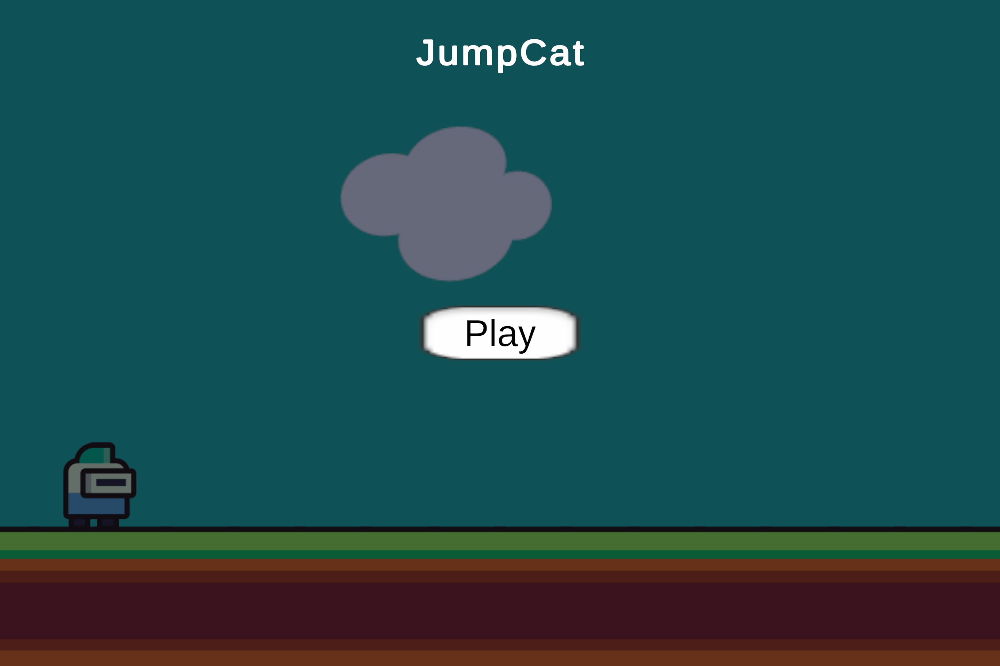
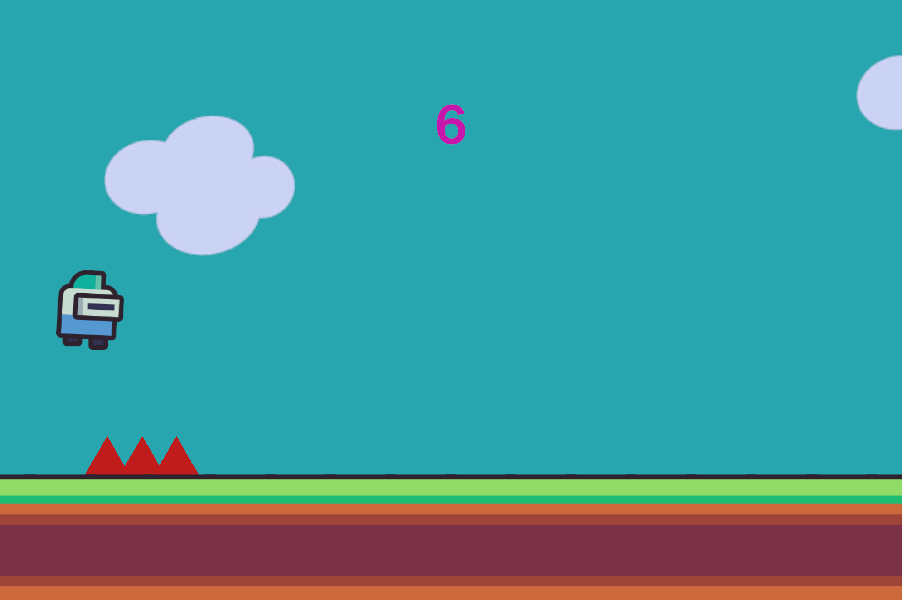
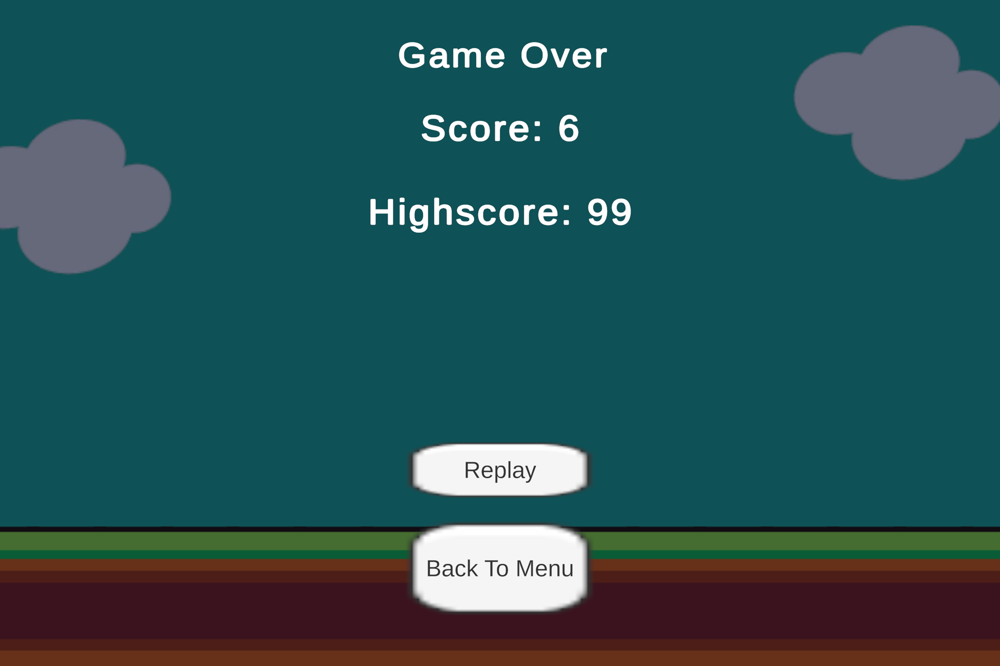

# 🎮 Jumpcat

Jumpcat is an **endless runner** game developed with **Unity 2D**.  
The character tries to escape obstacles by **jumping** and **ducking**.  

- 🏃 The character **gets faster** as it runs  
- 💥 Hitting an obstacle causes **Game Over**  
- 📈 The player’s **score is recorded**  
- 🏆 **High Score** is saved  

---

## 📌 About the Project
This game was created as part of the  
**Unity Game Development Workshop** organized by **BTK Academy** in Ankara.

---

## 🖼️ Screenshots

  
  
  

---

## 📜 Certificate

